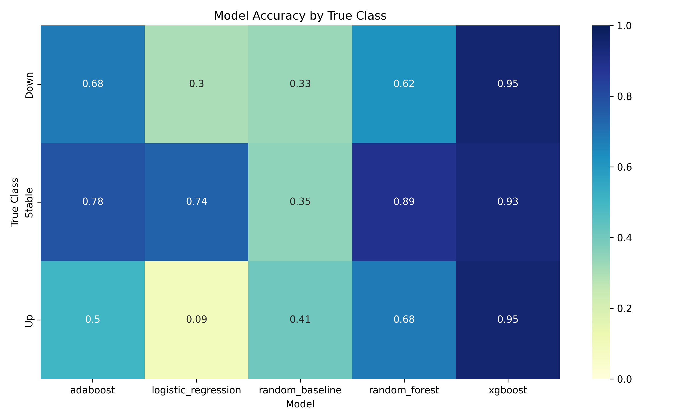

# EarningsWhisperer: AI Reads Earnings Reports So You Don’t Have To

## **Project Description**
Earnings reports offer valuable insights into a company's financial health, but investors frequently find it challenging to gauge how the market will react. Predicting stock price movements is challenging because of market efficiency, complex dependencies, and the influence of multiple factors. 
This project integrates **natural language processing (NLP)** and **historical stock data** to build a machine learning model capable of **predicting stock movement (up, down, or stable)** following earnings announcements. By leveraging sentiment analysis of earnings reports and financial indicators, the project aims to provide a data-driven approach to improve investment decision-making.

To ensure feasibility and relevance, the project will focus on **10 major publicly traded tech companies** with significant market influence and high trading volume:
1. Apple (AAPL)
2. Microsoft (MSFT)
3. Google (GOOGL)
4. Amazon (AMZN)
5. Nvidia (NVDA)
6. Meta (META)
7. Tesla (TSLA)
8. Advanced Micro Devices (AMD)
9. Intel (INTC)
10. Salesforce (CRM)

🎥 Check out my mid-term presentation here! https://youtu.be/EHeJyJaSBjA

## **Goals**
- Develop a **stock movement prediction model** based on earnings reports.
- Implement **sentiment analysis** to classify earnings reports as **positive, neutral, or negative**.
- Train a **machine learning model** (Logistic Regression, Random Forest, and Deep Neural Networks) to predict stock movement based on report sentiment.
- Create **visualizations** to showcase stock trends before and after earnings.

## **Data Collection**
### **Sources:**
- **[Yahoo Finance](https://pypi.org/project/yfinance/)** → I used the Yahoo Finance API (yfinance library) to collect historical stock data for the target companies, covering the period from 2021-01-01 to 2024-12-31. I limited the data range to keep the focus on recent market behavior while avoiding COVID-era volatility. It provides sufficient historical data, since this timeframe includes approximately 12 quarterly reports per company.
- **[SEC Edgar Database](https://pypi.org/project/sec-edgar-downloader/))** → I utilized the SEC EDGAR database(sec_edgar_downloader) to collect 8-K filings containing earnings announcements. These reports provide the textual data for my sentiment analysis.

## **Data Processing:**
- **Stock Data Processing:**
  - **Daily Returns:** Computed as percentage change between closing prices.
  - **Technical Indicators:**
    - 5-day and 10-day Moving Averages to capture short-term trends
    - Volatility as the rolling standard deviation of returns
    - Relative Strength Index (RSI) to assess overbought or oversold conditions
    - Volume Change to flag unusual trading activity.
  - **Post-Earnings Day Flags**: Extract trading data from the 5-day window following each earnings report.
    
- **Earnings Report Text Processing:**
  - Extracted raw text from 8-K filings.
  - Applied dictionary-based sentiment analysis using curated lists of positive and negative financial terms
  - Computed sentiment score as the relative frequency of positive vs. negative terms
  - Labeled sentiment as positive, neutral, or negative
    
- **Target Variable Generation:** 
  - Calculated the 1-day stock return following the earnings date.
  - Classified each movement as:
    - Up (1): return > +1%
    - Stable (0): between -1% and +1%
    - Down (-1): return < -1%

## **Methodology**
- **Sentiment Analysis:** I implemented a dictionary-based sentiment analysis approach using financial-specific terminology.
<pre> # Sentiment analysis: count positive and negative words
positive_words = ['increase', 'growth', 'improved', 'higher', 'strong', 'positive', 'exceeded', 'beat', 'record', 'success', 'profit', 'gain'] 
negative_words = ['decrease', 'decline', 'fell', 'lower', 'weak', 'negative', 'missed', 'loss', 'challenging', 'difficult', 'down', 'reduced'] </pre>
This approach allows me to quantify the sentiment expressed in earnings reports.
- **Feature Engineering:** I combine sentiment analysis results with technical indicators to create a comprehensive feature set.
<pre> # Create feature record
        feature = {
            'ticker': ticker,
            'company': sentiment['company'],
            'year': year,
            'quarter': quarter,
            'report_date': report_date,
            'sentiment_score': sentiment['sentiment_score'],
            'sentiment': sentiment['sentiment'],
            'return_1d': return_1d,
            'target': target
        }
        
        # 7-day window before the earnings report - technical indicator calculation
        pre_date = report_date - timedelta(days=7)
        pre_data = df[(df.index >= pre_date) & (df.index < report_date)]
        
        if not pre_data.empty:
            # average return before earnings
            feature['pre_return'] = pre_data['Daily_Return'].mean()
            # average volume change
            feature['pre_volume_change'] = pre_data['Volume_Change'].mean()
            # RSI
            feature['pre_rsi'] = pre_data['RSI'].iloc[-1] if 'RSI' in pre_data else np.nan </pre>

## **Modeling**
### **Data Preparation**
- Split data into 80% training and 20% testing sets
- Normalize features using StandardScaler
- One-hot encode categorical variables like sentiment
### **Machine Learning Models**
- Logistic Regression
- Random Forest
### **Evaluation Metrics**
- Accuracy: Proportion of correctly predicted movements
- Classification Report
- Confusion Matrix

## **Preliminary Visualizations**
### **Sentiment Distribution by Company** ###
My analysis of sentiment across companies revealed interesting patterns in how different companies communicate in their earnings reports:

This visualization demonstrates that:
- Companies like Apple, Microsoft, and Google consistently use positive language in their reports
- AMD and Intel show more variability in sentiment scores
- NVIDIA occasionally shows sharp negative sentiment, likely tied to specific challenging quarters

### **Model Accuracy Comparison** ###
I compared the performance of two machine learning approaches:

The Random Forest model significantly outperforms Logistic Regression, achieving 79.07% accuracy compared to 53.49%. This improvement confirms that ensemble methods better capture the complex, non-linear relationships in my data.

### **Class-Specific Performance** ###
Examining performance across different movement classes provides deeper insights:

This heatmap shows:
- Both models excel at predicting "stable" (0) movements (~90% accuracy)
- Random Forest dramatically outperforms Logistic Regression on "down" (-1) predictions (73% vs. 17%)
- "Up" (1) predictions remain challenging, with Random Forest achieving moderate success (40%) while Logistic Regression completely fails (0%)

### **Confusion Matrices** ###
The confusion matrices reveal the specific prediction patterns of my models:

The Logistic Regression model shows a strong bias toward predicting the "stable" class, essentially betting that nothing dramatic will happen after earnings announcements.

The Random Forest model makes more balanced predictions across classes, correctly identifying 22 of 30 "down" movements and 42 of 46 "stable" periods.

### **Coefficients Analysis**
By examining the coefficients from our Logistic Regression model, we gain valuable insights into the factors driving each movement class:
### **Down Class Coefficients**

For "down" predictions, lower RSI values and decreased volume tend to precede downward movements.
### **Stable Class Coefficients**

For "stable" predictions, higher RSI and positive pre-returns indicate stability.
### **Up Class Coefficients**

For "up" predictions, increased trading volume before earnings is the strongest predictor.
 
## **Key Findings**
### **Model Performance**
- Baseline (Random Guessing): ~33% accuracy (3 classes)
- Logistic Regression: 53.49% accuracy
- Random Forest: 79.07% accuracy
### **Class-Specific Performance**
- Both models excel at predicting "stable" (0) movements (~90% accuracy)
- Random Forest dramatically outperforms Logistic Regression on "down" (-1) predictions (73% vs. 17%)
- "Up" (1) predictions remain challenging, with Random Forest achieving moderate success (40%) while Logistic Regression completely fails (0%)

## **Moving Forward**
Moving forward, I am going to enhance my NLP approach beyond simple dictionary-based sentiment analysis, addressing class imbalance to improve prediction of upward movements. I will also attempt to use Deep Neural Networks.
  
## **Project Structure**
Below is the intended project structure (as is in my local machine), but was not able to include the entire data/ due to size constraints.
<pre>
  EarningsWhisperer/
├── data/
│   ├── raw/                  # Not included in repo due to size constraints
│   │   ├── stock_prices/
│   │   ├── earnings_dates/
│   │   └── earnings_filings/
│   ├── processed/            # Included in repo as processed/
│   └── features/             # Included in repo as features/
├── results/
├── visualizations/
├── data_collection.py
├── data_processing.py
├── modeling.py
├── visualizations.py
└── README.md
</pre>

In investing, an informed guess beats a gut feeling!
