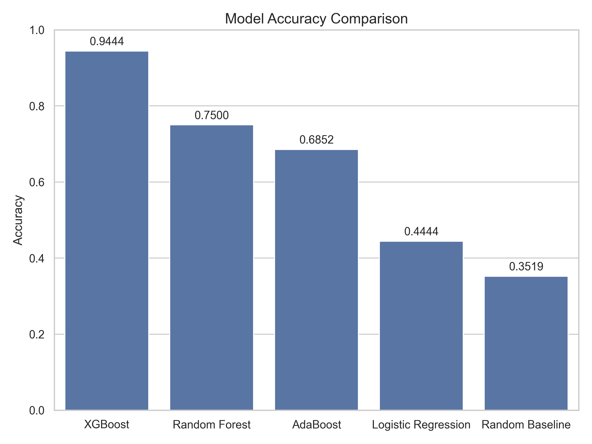
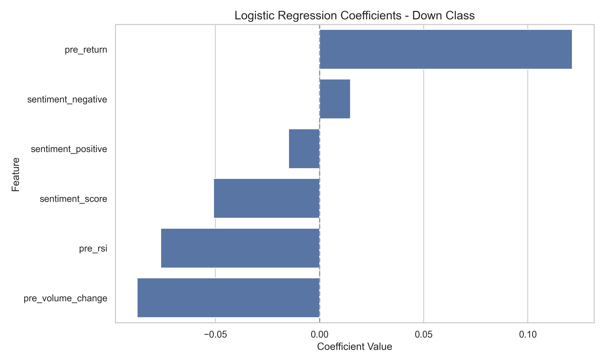

# EarningsWhisperer: AI Reads Earnings Reports So You Don’t Have To

## **Project Description**
Earnings reports offer valuable insights into a company's financial health, but investors frequently find it challenging to gauge how the market will react. Predicting stock price movements is challenging because of market efficiency, complex dependencies, and the influence of multiple factors. 

EarningsWhisperer integrates **natural language processing (NLP)** and **historical stock data** to build a machine learning model capable of **predicting stock movement (up, down, or stable)** following earnings announcements. By leveraging sentiment analysis of earnings reports and financial indicators, the project aims to provide a data-driven approach to improve investment decision-making.

To ensure feasibility and relevance, the project will focus on **10 major publicly traded tech companies** with significant market influence and high trading volume:
1. Apple (AAPL)
2. Microsoft (MSFT)
3. Google (GOOGL)
4. Amazon (AMZN)
5. Nvidia (NVDA)
6. Meta (META)
7. Tesla (TSLA)
8. Advanced Micro Devices (AMD)
9. Intel (INTC)
10. Salesforce (CRM)

🎥 Check out my final presentation here!

## **Goals**
- Develop a **stock movement prediction model** based on earnings reports.
- Implement **sentiment analysis** to classify earnings reports as **positive, neutral, or negative**.
- Train a **machine learning model** (Classical Models and Deep Neural Networks) to predict stock movement based on report sentiment.
- Create **visualizations** to showcase stock trends before and after earnings.

## **File Descriptions**
- `data_collection.py`
  - Downloads historical stock price data from Yahoo Finance and 8-K earnings filings from the SEC EDGAR database. Outputs are stored under data/raw/ in structured subfolders.
- `data_processing.py`
  - Calculates technical indicators and return metrics, labels stock movement, and merges financial data with sentiment. Produces a modeling-ready dataset at data/features/combined_features.csv.
- `enhanced_sentiment_analysis.py`
  - Performs transformer-based sentiment analysis using RoBERTa on earnings reports. Generates sentiment scores and categories for use in modeling.
- `modeling.py`
  - Trains classical machine learning models (Logistic Regression, Random Forest, AdaBoost, XGBoost) on tabular features. Evaluates and saves performance metrics and model artifacts.
- `neural_network_model.py`
  - Implements and trains neural models including FFNN and 1D CNN using Keras. Includes support for early stopping and regularization.
- `visualizations.py`
  - Generates plots including confusion matrices, sentiment distributions, and model comparison charts. Saves all visual outputs to the visualizations/ directory.
- `create_sample_data.py`
  - Creates a smaller subset of test data for developing and testing the EarningsWhisperer pipeline without requiring the full data collection process.
- `Makefile`
  - Provides a streamlined way to build, run, and manage the project.
- `requirements.txt`
  - Lists all the Python package dependencies required by the project.
 
## **Data Pipeline Overview**
The following sections walk through the full data science lifecycle used in this project, structured around:
**Data Collection → Data Processing → Sentiment Analysis → Modeling → Evaluation.**

Each step builds on the files described above and shows how the system was implemented from end to end.

## **Data Collection**
### **Sources:**
- **[Yahoo Finance](https://pypi.org/project/yfinance/)** → I used the Yahoo Finance API (yfinance library) to collect historical stock data for the target companies, covering the period from 2021-01-01 to 2024-12-31. I limited the data range to keep the focus on recent market behavior while avoiding COVID-era volatility. It provides sufficient historical data, since this timeframe includes approximately 12 quarterly reports per company.
- **[SEC Edgar Database](https://pypi.org/project/sec-edgar-downloader/))** → I utilized the SEC EDGAR database(sec_edgar_downloader) to collect 8-K filings containing earnings announcements. These reports provide the textual data for my sentiment analysis.

## **Data Processing:**
- **Stock Data Processing:**
  - **Daily Returns:** Computed as percentage change between closing prices.
  - **Technical Indicators:**
    - 5-day and 10-day Moving Averages to capture short-term trends
    - Volatility as the rolling standard deviation of returns
    - Relative Strength Index (RSI) to assess overbought or oversold conditions
    - Volume Change to flag unusual trading activity.
  - **Post-Earnings Day Flags**: Extract trading data from the 5-day window following each earnings report.
    
- **Earnings Report Text Processing:**
  - Extracted raw text from 8-K filings.
  - Applied dictionary-based sentiment analysis using curated lists of positive and negative financial terms
  - Computed sentiment score as the relative frequency of positive vs. negative terms
  - Labeled sentiment as positive, neutral, or negative
    
- **Target Variable Generation:** 
  - Calculated the 1-day stock return following the earnings date.
  - Classified each movement as:
    - Up (1): return > +1%
    - Stable (0): between -1% and +1%
    - Down (-1): return < -1%

## **Methodology**
- **Sentiment Analysis:**
  1. **Dictionary-Based Sentiment**
      - I implemented a dictionary-based sentiment analysis approach using financial-specific terminology.
      <pre> # Sentiment analysis: count positive and negative words
      positive_words = ['increase', 'growth', 'improved', 'higher', 'strong', 'positive', 'exceeded', 'beat', 'record', 'success', 'profit', 'gain'] 
      negative_words = ['decrease', 'decline', 'fell', 'lower', 'weak', 'negative', 'missed', 'loss', 'challenging', 'difficult', 'down', 'reduced'] </pre>
      - Score = (#positive - #negative) / total words
      - Label = positive, negative, or neutral
      This approach allowed me to quantify the sentiment expressed in earnings reports.
  
  2. **Transformer-Based Sentiment (RoBERTa)** (`enhanced_sentiment_analysis')
      - Tokenized and chunked long earnings texts (512 token limit)
      - Run zero-shot inference via RoBERTa classifier
      - Label mapping:
        - `LABEL_2`: positive (+score)
        - `LABEL_1`: neutral (0)
        - `LABEL_0`: negative (−score)

- **Feature Engineering:** I combined sentiment analysis results with technical indicators to create a comprehensive feature set.
<pre> # Create feature record
        feature = {
            'ticker': ticker,
            'company': sentiment['company'],
            'year': year,
            'quarter': quarter,
            'report_date': report_date,
            'sentiment_score': sentiment['sentiment_score'],
            'sentiment': sentiment['sentiment'],
            'return_1d': return_1d,
            'target': target
        }
        
        # 7-day window before the earnings report - technical indicator calculation
        pre_date = report_date - timedelta(days=7)
        pre_data = df[(df.index >= pre_date) & (df.index < report_date)]
        
        if not pre_data.empty:
            # average return before earnings
            feature['pre_return'] = pre_data['Daily_Return'].mean()
            # average volume change
            feature['pre_volume_change'] = pre_data['Volume_Change'].mean()
            # RSI
            feature['pre_rsi'] = pre_data['RSI'].iloc[-1] if 'RSI' in pre_data else np.nan </pre>

## **Modeling**
### **Data Preparation**
- Split data into 80% training and 20% testing sets
- Normalize features using StandardScaler
- One-hot encode categorical variables like sentiment
- Handle class imbalance by adjusting test size based on dataset size, ensuring sufficient samples per class
  
### **Machine Learning Models**

Hyperparameter tuning done through `GridSearchCV` with stratified k-fold cross-validationn to find optimal model configurations while preventing overfitting.

**Baseline:** 
- Random baseline: Implemented to establish a performance floor (~33% for three-class classification)

**Classical Models**: implemented in `modeling.py`
: implemented in `modeling.py`
  - Logistic Regression  
    : chosen for its interpretability and ability to provide insights into feature importance
  - Random Forest  
    : chosen for its strength at capturing non-leinear relationships and outliers
  - AdaBoost  
    : chosen for its ability to focus on difficult-to-classify examples
  - XGBoost  
    : chosen for its high performance in structured data prediction tasks

**Deep Learning**: implemented in `neural_network_model.py`
  - Feedforward Neural Network (FFNN)
  - 1D Convolutional Neural Network (CNN)
  - CNN with dense layers and dropout

### **Evaluation Strategy**
- **Cross-Validation**  
  : Stratified k-fold cross validation with adaptive fold selection based on dataset size
- **Metrics**  
  - Accuracy: Proportion of correctly predicted movements
  - Classification Report
  - Confusion Matrix
- **Feature Importance Analysis**

## **Preliminary Visualizations**
### **Sentiment Distribution by Company** ###
My analysis of sentiment across companies revealed interesting patterns in how different companies communicate in their earnings reports:

This visualization demonstrates that:
- Companies like Apple, Microsoft, and Google consistently use positive language in their reports
- AMD and Intel show more variability in sentiment scores
- NVIDIA occasionally shows sharp negative sentiment, likely tied to specific challenging quarters

### **Model Accuracy Comparison** ###
I compared the performance of two machine learning approaches:

The Random Forest model significantly outperforms Logistic Regression, achieving 79.07% accuracy compared to 53.49%. This improvement confirms that ensemble methods better capture the complex, non-linear relationships in my data.

### **Class-Specific Performance** ###
Examining performance across different movement classes provides deeper insights:

This heatmap shows:
- Both models excel at predicting "stable" (0) movements (~90% accuracy)
- Random Forest dramatically outperforms Logistic Regression on "down" (-1) predictions (73% vs. 17%)
- "Up" (1) predictions remain challenging, with Random Forest achieving moderate success (40%) while Logistic Regression completely fails (0%)

### **Confusion Matrices** ###
The confusion matrices reveal the specific prediction patterns of my models:

The Logistic Regression model shows a strong bias toward predicting the "stable" class, essentially betting that nothing dramatic will happen after earnings announcements.

The Random Forest model makes more balanced predictions across classes, correctly identifying 22 of 30 "down" movements and 42 of 46 "stable" periods.

### **Coefficients Analysis**
By examining the coefficients from our Logistic Regression model, we gain valuable insights into the factors driving each movement class:
### **Down Class Coefficients**

For "down" predictions, lower RSI values and decreased volume tend to precede downward movements.
### **Stable Class Coefficients**

For "stable" predictions, higher RSI and positive pre-returns indicate stability.
### **Up Class Coefficients**

For "up" predictions, increased trading volume before earnings is the strongest predictor.
 
## **Key Findings**
### **Model Performance**
- Baseline (Random Guessing): ~33% accuracy (3 classes)
- Logistic Regression: 44.44% accuracy
- Random Forest: 75% accuracy
- AdaBoost: 68.52%
- XGBoost: 94.44%
  
### **Class-Specific Performance**
- Both models excel at predicting "stable" (0) movements (~90% accuracy)
- Random Forest dramatically outperforms Logistic Regression on "down" (-1) predictions (73% vs. 17%)
- "Up" (1) predictions remain challenging, with Random Forest achieving moderate success (40%) while Logistic Regression completely fails (0%)

## **Limitations**
- Although I implemented both RoBERTa and Neural Network models and have run them before, my laptop crashed while trying to run certain files again for final check before pushing them to my repo. I lost substantial amount of data.
- RoBERTa ran for 7+ hours on only 40% of the each filing, but still did not complete.

  📌 Unfortunately, the results were lost, but one interesting observation was that XGBoost outperformed neural networks, which was unexpected. I believe this is because XGBoost handles small-to-medium structured tabular datasets particularly well, while the neural networks likely underperformed due to insufficient data volume and limited training time to leverage their full capacity.

## **Reproducability**

In order to reproduce the result, follow these steps:
1. Clone the repository:
   <pre>
   git clone https://github.com/alexiak0127/EarningsWhisperer.git
   cd EarningsWhisperer</pre>
2. Run the entire pipeline:

    `make all`
    
    `make all` sets up the environment, processes data, train models, and generates visualizations 

   **Note:**
- All data (stock prices and earnings filings) is automatically collected via yfinance and sec-edgar-downloader.
- No need to manually provide raw data.

  
## **Project Structure**
Below is the intended project structure (as is in my local machine), but was not able to include the entire data/ due to size constraints. It is not necessary to upload the entire dataset as it is auto-downloaded via yfinance + SEC EDGAR.
<pre>
EarningsWhisperer/
├── data/
│   ├── raw/                  # Not included — auto-downloaded via yfinance + SEC EDGAR
│   ├── processed/            # Intermediate cleaned data
│   └── features/             # Final engineered features for modeling
├── models/                   # Trained model files (output)
├── results/                  # Model outputs and performance logs
├── visualizations/           # Output plots and charts
├── data_collection.py        # Downloads raw stock + earnings data
├── data_processing.py        # Cleans + engineers features
├── enhanced_sentiment_analysis.py  # RoBERTa-based sentiment scoring
├── modeling.py               # Classical ML models (LogReg, RF)
├── neural_network_model.py   # Neural models (FFNN, CNN, LSTM)
├── visualizations.py         # All chart generation code
├── Makefile                  # Reproducibility: install, run, test
├── requirements.txt          # Python dependencies
└── README.md                 # Final report and project documentation

</pre>

## **Reflection**
This project taught me the importance of designing robust and modular pipelines in real-world machine learning tasks. Working across multiple stages from data processing to modeling and evaluation challenged me to integrate domain knowledge with technical skills. Although hardware limitations prevented full execution of neural networks and RoBERTa on the complete dataset, I was able to implement and structure them correctly, which reflects a solid grasp of both classical and modern ML techniques.

Most importantly, I learned how model selection, data limitations, and execution constraints can significantly shape outcomes. The surprising strength of XGBoost on this dataset—compared to early neural net trials—demonstrated that the most complex model is not always the most effective in practice. Building for reproducibility and clarity also taught me how crucial clean code and documentation are for collaboration and debugging.

**In investing, an informed guess beats a gut feeling!**
